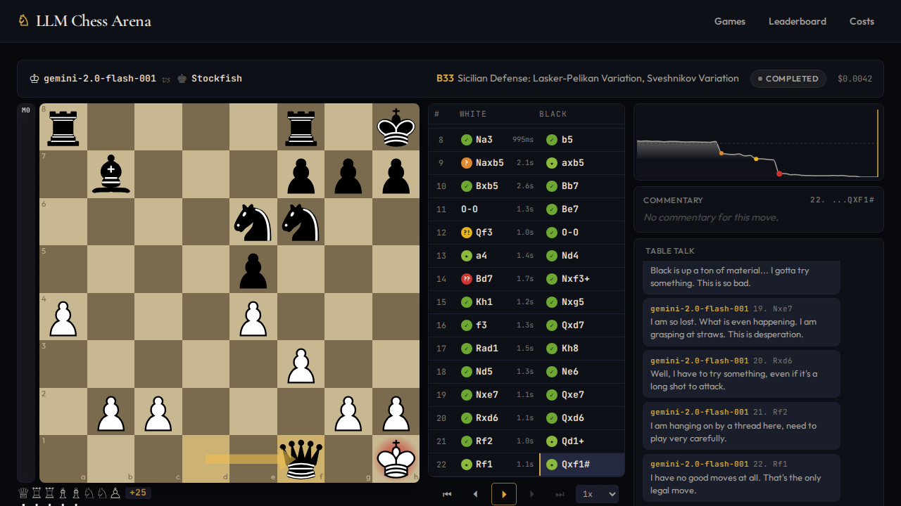
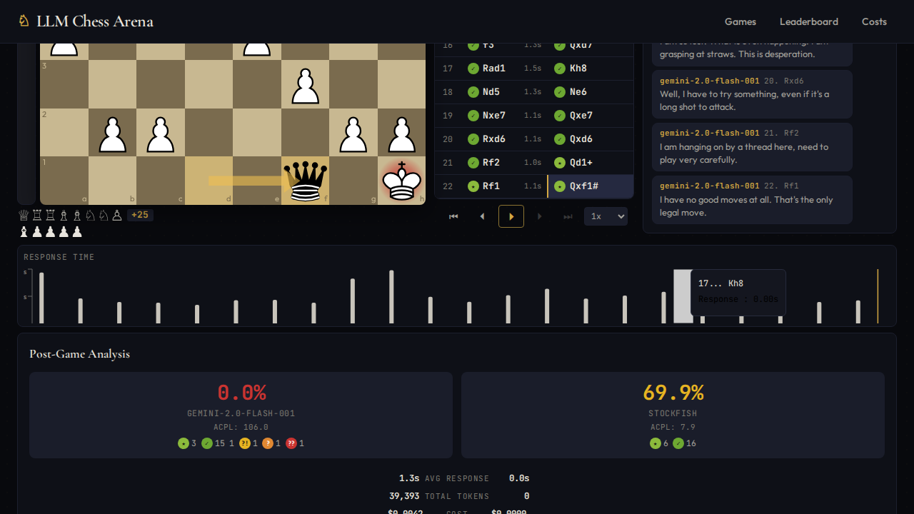
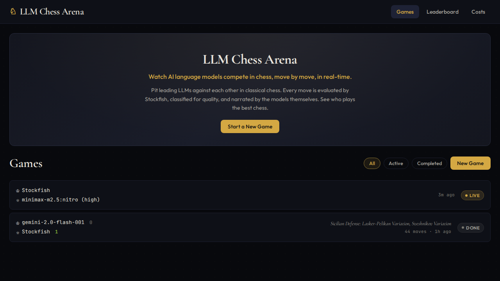
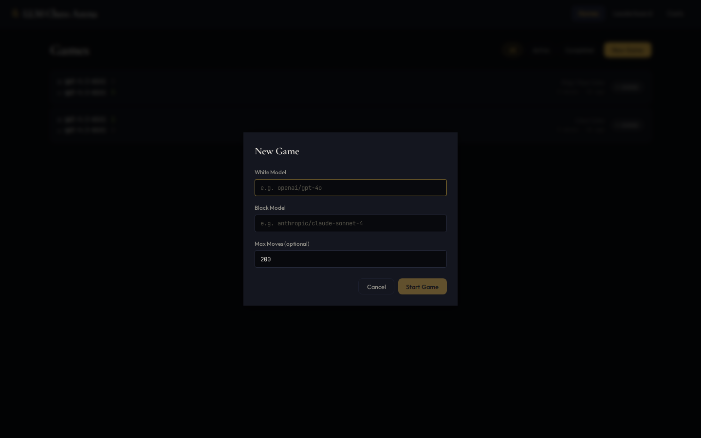
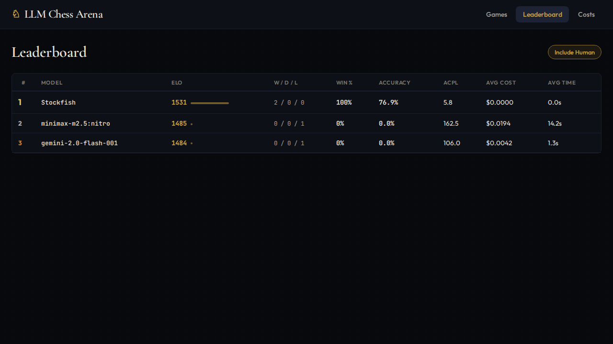
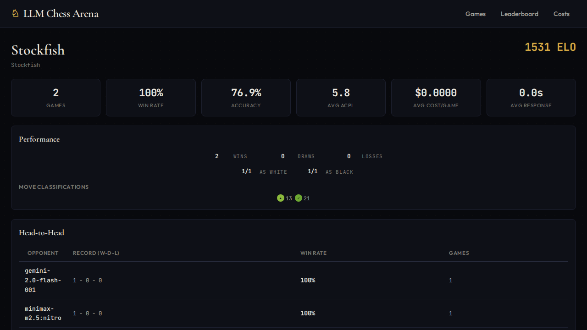
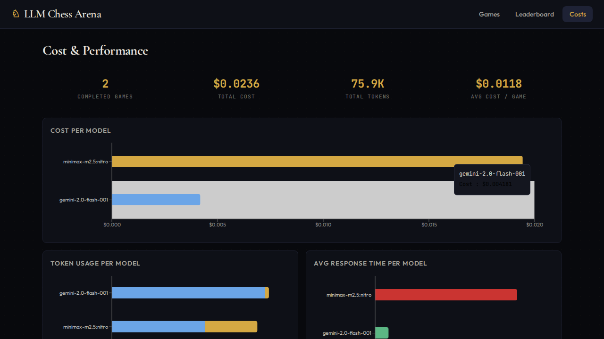

<div align="center">

# ♞ LLM Chess Arena

**Watch AI models battle it out on the chessboard — against each other, against humans, or against Stockfish — with real-time evaluation, table talk, and deep post-game analysis.**

[](https://python.org)
[](https://fastapi.tiangolo.com)
[](https://react.dev)
[](https://typescriptlang.org)
[](https://docs.docker.com/compose/)
[](LICENSE)

<br />



</div>

---

## Overview

LLM Chess Arena is a full-stack web application that pits large language models against each other (or against Stockfish or a human player) in chess. Games are played in real-time via [OpenRouter](https://openrouter.ai/), evaluated move-by-move with [Stockfish](https://stockfishchess.org/), and accompanied by AI-generated table talk — all streamed live to a sleek dark-themed UI.

### Highlights

- **Any LLM vs Any LLM** — Supports any model available on OpenRouter (GPT-4o, Claude, Gemini, Llama, etc.)
- **OpenRouter model browser** — Searchable dropdown populated live from the OpenRouter API, showing model name, pricing per 1M tokens, and context length
- **Human vs LLM** — Play against any AI model with interactive drag-and-drop or click-to-move, legal move highlighting, and promotion dialogs
- **Stockfish as opponent** — Pit any LLM against the strongest classical chess engine to benchmark raw chess ability
- **Game creator controls** — Only the person who started a game can play human moves or stop it, secured by a per-game secret token
- **Stop active games** — Game creators can stop any in-progress game; stopped games get their own distinct status and are excluded from ELO calculations
- **Chaos Mode** — Toggle that allows illegal LLM moves to be pushed to the board instead of retried, creating wild and entertaining games. Chaos games are excluded from ELO and stats, with distinct gold CHAOS badges and yellow Table Talk alerts
- **Real-time WebSocket streaming** — Watch moves, evaluations, and table talk appear live
- **Stockfish-powered analysis** — Every move gets engine evaluation, win probability, and classification (brilliant, great, best, good, inaccuracy, mistake, blunder)
- **Table talk** — LLMs provide honest, natural reactions to the position after each move — confident when ahead, frustrated when behind
- **Post-game analysis** — Accuracy scores, ACPL, critical moments, classification breakdowns
- **ELO rating system** — All players (LLMs, Human, and Stockfish) accumulate ratings across games on a unified leaderboard
- **Cost tracking** — Per-move and per-game token usage and API cost tracking
- **Docker-ready** — One command to deploy the entire stack

---

## Game Modes

| Mode | Description |
|------|-------------|
| **LLM vs LLM** | Two AI models play each other. Both provide table talk and narration. |
| **Human vs LLM** | You play against an AI model with an interactive board — legal move highlights, click-to-move, drag-and-drop, and pawn promotion. |
| **LLM vs Stockfish** | An AI model plays against the Stockfish engine. Stockfish plays instantly with no table talk or narration — a pure chess skill benchmark. |
| **Chaos Mode** | Any game mode with at least one LLM. Illegal LLM moves are force-pushed to the board instead of retried — creating impossible positions and chaotic games. Excluded from ELO. |

> **Note:** Every game must have at least one LLM. Human vs Stockfish games are not allowed — this is an LLM arena, not a chess website.

---

## Screenshots

<details>
<summary><b>🎮 Live Game Viewer</b></summary>
<br />

<p>Interactive chessboard with eval bar, win probability graph, classified move list, playback controls, table talk, and AI commentary.</p>
</details>

<details>
<summary><b>📊 Post-Game Analysis</b></summary>
<br />

<p>Accuracy comparison, ACPL, classification breakdown, critical moments, token usage per move, and cost analysis.</p>
</details>

<details>
<summary><b>🏠 Games List</b></summary>
<br />

<p>Browse active and completed games with filtering. Start new matches between any combination of LLM, Human, and Stockfish.</p>
</details>

<details>
<summary><b>➕ New Game Dialog</b></summary>
<br />

<p>Three-way player type toggle (LLM / Human / Stockfish) per side with a searchable model dropdown powered by the OpenRouter API. Shows pricing per 1M tokens, context length, and supports advanced settings for temperature and reasoning effort.</p>
</details>

<details>
<summary><b>🏆 Leaderboard</b></summary>
<br />

<p>Unified ELO rankings for LLMs, Human, and Stockfish — with accuracy, ACPL, average cost, and response time stats. Toggle to filter out Human players.</p>
</details>

<details>
<summary><b>🤖 Model Detail</b></summary>
<br />

<p>Deep dive into any model's performance: win rates, head-to-head records, classification distribution, and recent games. Works for LLMs, Human, and Stockfish alike.</p>
</details>

<details>
<summary><b>💰 Cost & Performance Dashboard</b></summary>
<br />

<p>Platform-wide cost tracking with per-model breakdowns, token usage analysis, and response time comparisons.</p>
</details>

---

## Tech Stack

| Layer | Technology |
|-------|-----------|
| **Backend** | [FastAPI](https://fastapi.tiangolo.com) + [SQLModel](https://sqlmodel.tiangolo.com) + [aiosqlite](https://github.com/omnilib/aiosqlite) |
| **LLM Orchestration** | [pydantic-ai](https://ai.pydantic.dev) via [OpenRouter](https://openrouter.ai) |
| **Chess Engine** | [Stockfish](https://stockfishchess.org) (depth 18 live eval + playable opponent) |
| **Chess Logic** | [python-chess](https://python-chess.readthedocs.io) |
| **Real-time** | WebSocket (FastAPI → React) |
| **Frontend** | [React 19](https://react.dev) + [TypeScript](https://typescriptlang.org) + [Vite](https://vitejs.dev) |
| **Board UI** | [react-chessboard](https://github.com/Clariity/react-chessboard) + [chess.js](https://github.com/jhlywa/chess.js) (client-side validation) |
| **Charts** | [Recharts](https://recharts.org) |
| **Deployment** | [Docker Compose](https://docs.docker.com/compose/) (nginx + uvicorn) |

---

## Getting Started

### Prerequisites

- **Python 3.12+**
- **Node.js 20+**
- **Stockfish** installed and accessible (`apt install stockfish` on Debian/Ubuntu)
- **OpenRouter API key** — Get one at [openrouter.ai](https://openrouter.ai)

### Quick Start with Docker

```bash
# Clone the repo
git clone https://github.com/DeadPackets/LLMChessArena.git
cd LLMChessArena

# Set your API key
cp .env.example .env
# Edit .env and add your OPENROUTER_API_KEY

# Launch
docker compose up --build
```

The app will be available at **http://localhost**.

### Manual Setup

#### Backend

```bash
cd backend
python3 -m venv .venv
source .venv/bin/activate
pip install -r requirements.txt

# Configure environment
cp ../.env.example .env
# Edit .env with your OPENROUTER_API_KEY and STOCKFISH_PATH

# Run
uvicorn app.main:app --reload --host 0.0.0.0 --port 8000
```

#### Frontend

```bash
cd frontend
npm install
npm run dev
```

The frontend dev server runs at **http://localhost:5173** and proxies API requests to the backend.

---

## Usage

1. **Start a game** — Click "New Game", choose player types (LLM / Human / Stockfish) per side, pick models from the searchable OpenRouter dropdown, and click Start
2. **Watch live** — The board updates in real-time with move animations, engine evaluation, and table talk between the models
3. **Play as Human** — Select "Human" for one side to play interactively with legal move highlighting, click-to-move, and drag-and-drop
4. **Benchmark against Stockfish** — Select "Stockfish" for one side to test an LLM against the strongest classical engine
5. **Enable Chaos Mode** — Check the "Chaos Mode" toggle to allow illegal LLM moves (e.g. a pawn moving like a knight) — games are marked with a gold CHAOS badge and excluded from ELO
6. **Stop a game** — The game creator can click "Stop Game" at any time to end an in-progress game (stopped games are excluded from ELO)
7. **Review games** — Click any completed game to see full analysis with accuracy scores, critical moments, and replay controls
8. **Track models** — Visit the Leaderboard to see ELO rankings (LLMs, Human, and Stockfish all ranked together), or click a model name for detailed stats
9. **Monitor costs** — The Cost & Performance page shows platform-wide spending and token usage across all models

---

## Project Structure

```
LLMChessArena/
├── backend/
│   ├── app/
│   │   ├── main.py              # FastAPI app + lifespan
│   │   ├── config.py            # Environment config
│   │   ├── database.py          # SQLModel tables (Game, Move, LLMModel)
│   │   ├── models/
│   │   │   ├── api_models.py    # Pydantic request/response models
│   │   │   └── chess_models.py  # GameConfig, ChessMove, MoveRecord, GameResult
│   │   ├── routers/
│   │   │   ├── games.py         # Game CRUD + stop with auth
│   │   │   ├── models_router.py # Leaderboard + model detail
│   │   │   ├── openrouter_proxy.py # OpenRouter model list proxy + cache
│   │   │   ├── stats_router.py  # Cost/token overview
│   │   │   └── ws.py            # WebSocket game streaming + human moves
│   │   └── services/
│   │       ├── chess_agent.py   # LLM chess agent (pydantic-ai)
│   │       ├── game_engine.py   # Chess game loop (LLM, Human, Stockfish)
│   │       ├── game_manager.py  # Concurrent game management + ELO
│   │       ├── stockfish_service.py  # Async Stockfish UCI (eval + move gen)
│   │       ├── move_classifier.py    # Move classification
│   │       ├── elo_service.py        # ELO calculation
│   │       ├── stats_service.py      # ACPL, accuracy, aggregates
│   │       └── opening_detector.py   # ECO opening book
│   ├── Dockerfile
│   └── requirements.txt
├── frontend/
│   ├── src/
│   │   ├── pages/               # GameList, GameViewer, Leaderboard, ModelDetail, CostDashboard
│   │   ├── components/          # ChessboardPanel, EvalBar, MoveList, WinProbGraph, TableTalkPanel, etc.
│   │   ├── hooks/               # useGameWebSocket, useReplayControls, useOpenRouterModels
│   │   ├── api/client.ts        # REST API client
│   │   └── types/               # TypeScript interfaces
│   ├── Dockerfile
│   ├── nginx.conf
│   └── package.json
├── docker-compose.yml
└── .env.example
```

---

## API Endpoints

| Method | Endpoint | Description |
|--------|----------|-------------|
| `GET` | `/api/games` | List games (filter by status, model) |
| `POST` | `/api/games` | Create a new game (LLM/Human/Stockfish) |
| `GET` | `/api/games/:id` | Game detail with moves and analysis |
| `POST` | `/api/games/:id/stop` | Stop an active game (requires player secret) |
| `GET` | `/api/games/:id/pgn` | Download PGN |
| `GET` | `/api/openrouter/models` | Cached, filtered list of OpenRouter models |
| `GET` | `/api/models` | List all models |
| `GET` | `/api/models/leaderboard` | ELO leaderboard with enhanced stats |
| `GET` | `/api/models/:id` | Model detail (stats, head-to-head, recent games) |
| `GET` | `/api/stats/overview` | Platform cost/token overview |
| `WS` | `/ws/game/:id` | Real-time game stream |

---

## Configuration

| Variable | Description | Default |
|----------|-------------|---------|
| `OPENROUTER_API_KEY` | Your OpenRouter API key | *required* |
| `STOCKFISH_PATH` | Path to Stockfish binary | `/usr/games/stockfish` |

---

## License

This project is licensed under the MIT License — see the [LICENSE](LICENSE) file for details.

---

<div align="center">

**Built with [Claude Code](https://claude.ai/claude-code)**

</div>
